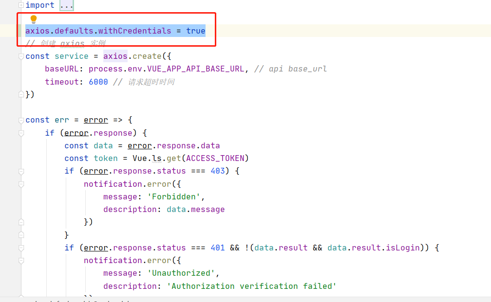
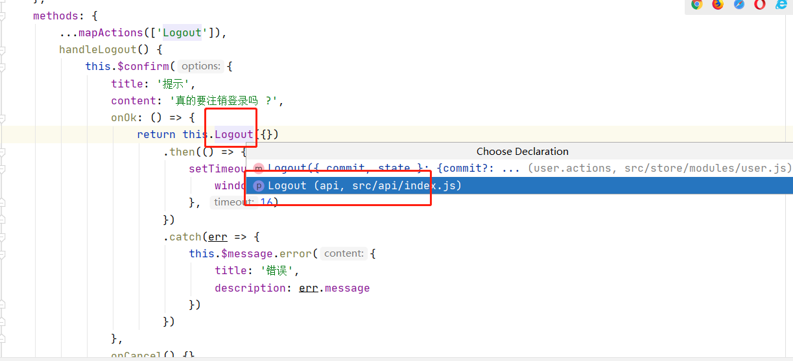
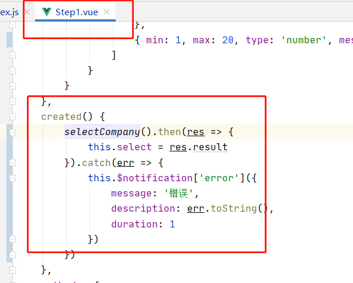
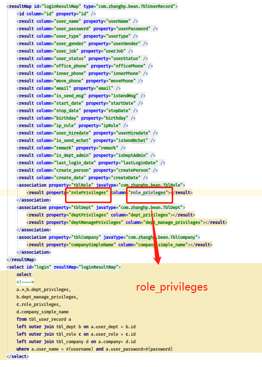

# 和家云02

### 第二节课课程内容总体大纲

1. 返会数据结果集
2. 数据回显的权限认证，来判断获取哪些模块
3. 编写模块返回
4. 退出登录

# 1.上半节课

## 1.数据结果集的返回

权限管理：

~~~
{
  message: "ok",
  result: {
    name: "admin",
    avatar: "/avatar2.jpg",
    role: {
      permissions: [
        {
          permissionId: "901"
        },
        {
          permissionId: "221"
        },
        {
          permissionId: "223",
        },
        {
          permissionId: "226",
        },
      ],
    },
  },
  code: 200,
}
~~~

ReturnObject结果对象封装：

可看出，封装完ReturnObject后，但发现还是跳转不了

## 2.获取到权限，指定跳转哪个具体模块，编写权限

controller编写users/info路径

~~~java
@RestController
public class LoginController {
    @Autowired
    private LoginService loginService;

    //登录调试
    @RequestMapping("/auth/login")
    public String Login01(@RequestParam("username") String username, @RequestParam("password") String password, HttpSession httpSession) {
        System.out.println("------------auth_login------------------");
        //密码加密打印
        //System.out.println(password);
        TblUserRecord tblUserRecord = loginService.login(username, password);
        //System.out.println(tblUserRecord);

        tblUserRecord.setToken(tblUserRecord.getUserName());

        httpSession.setAttribute("userRecord",tblUserRecord);

        ReturnObject returnObject = new ReturnObject(tblUserRecord);
        //return JSONObject.parseObject(JSONObject.toJSONString(returnObject));
        return JSONObject.toJSONString(returnObject);
    }

    //回显的功能模块
    @RequestMapping("/users/info")
    public JSONObject info(HttpSession httpSession){
        TblUserRecord tblUserRecord = (TblUserRecord)httpSession.getAttribute("userRecord");
        System.out.println(tblUserRecord);
        //获取权限集合
        String[] split = tblUserRecord.getTblRole().getRolePrivileges().split("-");
        List<Permission> lp = new ArrayList<>();
        for (String s : split) {
            lp.add(new Permission(s));
        }
        Permissions permissions = new Permissions(lp);
        UserInfo userInfo = new UserInfo(tblUserRecord.getUserName(), permissions);
        return JSONObject.parseObject(JSONObject.toJSONString(new ReturnObject(userInfo)));
    }

}
~~~

- 由于**user/info**也需要**auth/login**查询的tblUserRecord的数据,但user/info的方法，没有人给其参数的传递，所以可通过session共享实现。

- 但是涉及跨域，所以2个sessionId不一样，所以需要设置

1. 后端：

2.  前端：

在utils/request.js编写：

~~~
axios.defaults.withCredentials = true
~~~

## 3.组合返回的字符串对象的编写

4个对象类的图：

1. **Permission:** PermissionId
2. **Permissions：**List<Permission>
3. **UserInfo:**name,avatar,role
4. **ReturnObject:**message,cod,result

ReturnObject.result -》UserInfo . role -》一个Permissions -》多个Permission

## 4.退出登录

需要销毁session值

1. 前端组件：components/tools/UserMenu.vue：

找到请求地址，在后端填写

2.  后端：

~~~java
@RequestMapping("/auth/logout")
    public void logout(HttpSession httpSession){
        httpSession.invalidate();
    }
~~~

# 2.下半节课：

## 楼盘模块

1.  前端访问路径：src/config/router.config.js :

### 1.修改前端代码

1. 在step1.vue修改代码：

2. 在step1.vue中导入下方的estate.js：

~~~
import { selectCompany } from '@/api/estate'
~~~

3. step1.vue整体代码：

~~~js

~~~

3. 在api包下创建estate.js 中 selectCompany 方法:

前端样式规范抒写校验，会规范前端代码抒写：

2. 后端：

estate/selectCompany（请求路径在上方的estate.js的图）请求路径下通过后端传递数据库：

- controller层

~~~java
@Autowired
    private EstateService estateService;
    @RequestMapping("/estate/selectCompany")
    public JSONObject selectCompany(){
        System.out.println("selectCompany");
        List<String> companies = estateService.selectCompany();
        for (String company : companies) {
            System.out.println(company);
        }
        return JSONObject.parseObject(JSONObject.toJSONString(new ReturnObject(companies)));
    }
~~~

- service层

~~~java
@Service
public class EstateService {
    @Autowired
    private TblCompanyMapper tblCompanyMapper;

    public List<String> selectCompany(){
        return tblCompanyMapper.selectCompany();

    }
}
~~~

- xml文件

~~~xml
<select id="selectCompany" resultType="string">
        select company_full_name from tbl_company
</select>
~~~

# 3.编写所出现的问题

## 1.mybatis一对一关联获取不到tblRole的数据，为空值

问题出现在，**xml中关联字段的的列少写个字母**：

## 2.回显页面不成功

返回对象不对。

详情：https://www.mashibing.com/question/detail/6132

## 3.@Mapper和@MapperScan扫描问题

即使在yml写了包别名(type-aliases-package)，xml中resultType不指定具体包下的类，会产生空指针问题

https://www.mashibing.com/question/detail/6122

## 4.如果不清除网站的cookie，session会导致回显后，后端空指针异常

## 5.显示不了数据库中“公司”集合的原因

1. 前端代码的修改：views/property/add/Guide/step1.vue 中没有导入estates.js的方法

~~~
import { selectCompany } from '@/api/estate'
~~~

## 6.如果后台空指针

检查xml，sql，数据查询出了问题