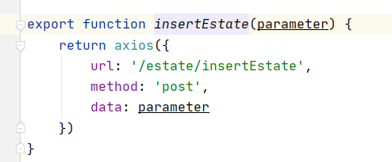
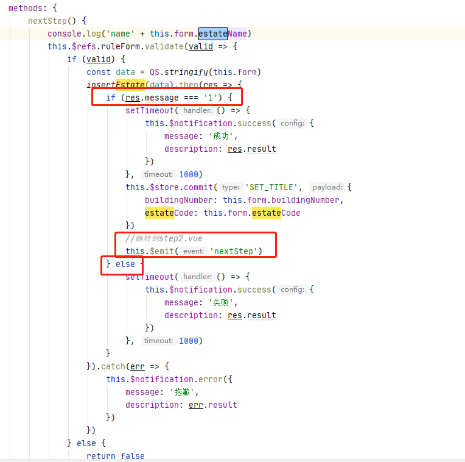
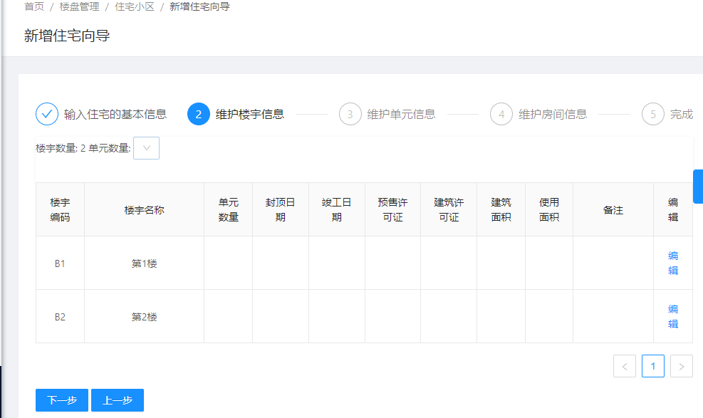
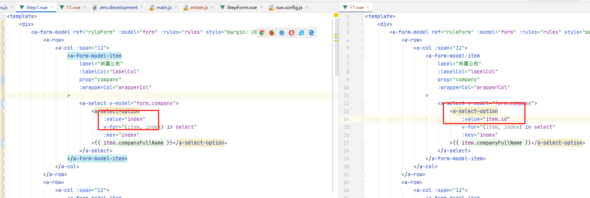
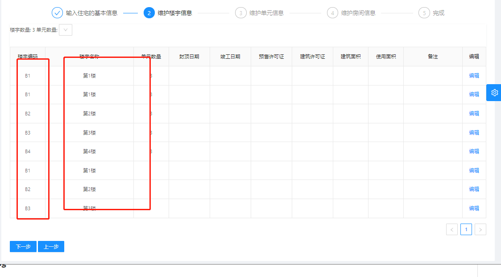
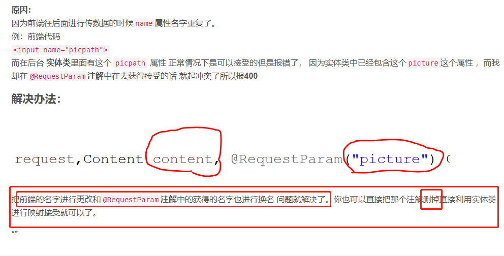

# 和家云03

# 第三节课内容总体大纲

### 1. step1中新增住宅（插入数据）

### 2. step1 -> step2 数据传递问题（前端知识）

### 3. 根据step1中填入的数据，后端做对应的楼宇数量创建

# 1.上半节课

## 1.1新增住宅

**细节**：

> 1. 传入后端数据，后端通过EstateService中InsertEstate方法中estate_code需判断是否在数据库存在
> 2. 在通过controller层，返回returnObject的message，result
> 3. 前端接收到后端传来的message，来进行是否跳转的判断

+ **前端**

  1. src/api/estate.js:

  

  2. src/views/property/addGuide/step1.vue:

     > 从后端接收数据 message ，进行判断是否跳转下一模块step2.vue
     >
     > 后端代码判断的是向数据库新增住宅，estate_code是否唯一

+ **后端**

  1. controller层

  ~~~java
  @RequestMapping("/estate/insertEstate")
      public JSONObject insertEstate( FcEstate fcEstate){
          System.out.println("estate/insertEstate");
          Integer result = estateService.insertEstate(fcEstate);
          if (resul t==0) {
              return JSONObject.parseObject(JSONObject.toJSONString(new ReturnObject("0","房产编码已经存在")));
          } else {
              return JSONObject.parseObject(JSONObject.toJSONString(new ReturnObject("1","插入房产成功")));
          }
      }
  ~~~

  2. service层：

     > 这里使用的是mybatisPlus自带的方法进行使用，所以不用自己写sql

  ~~~java
  /**
       * 插入住宅基本信息
       * 插入前，判断插入的值在数据库是否唯一
       * @param fcEstate 前端传来的fcEstate对象
       * @return
       */
      public Integer insertEstate(FcEstate fcEstate){
          //查询数据库是否有重复的estate_code字段
          QueryWrapper queryWrapper = new QueryWrapper();
          queryWrapper.eq("estate_code",fcEstate.getEstateCode());
          FcEstate fe = fcEstateMapper.selectOne(queryWrapper);
          int result = 0;
          //判断，是否插入
          if (fe == null ) {
              result = fcEstateMapper.insert(fcEstate);
  
          }
          return result;
      }
  ~~~

  3. 页面展示：

  

## 1.2 step1 —>step2 数据传递

> 详情看 **连老师** 的"楼盘管理笔记"

# 2.下半节课

## 2.1 新增住宅向导

+ **前端**

  1. src/views/property/addGuide/step2.vue:

     

  2. src/api/estate.js:

+ **后端**

1. controller层：

   ~~~java
   @RequestMapping("/estate/selectBuilding")
       public JSONObject selectBuilding(Integer buildingNumber, String estateCode){
           System.out.println("select_Building");
           List<FcBuilding> fcBuildings = estateService.selectBuilding(buildingNumber, estateCode);
           return JSONObject.parseObject(JSONObject.toJSONString(new ReturnObject(fcBuildings)));
       }
   ~~~

2. service层：

   ~~~java
   /**
        * 因为数据库没有楼宇的数据(fc_building表)，所以通过此服务层创建数据，在返回查询
        * @param buildingNumber 楼宇数量
        * @param estateCode 楼宇编码(唯一)
        * @return
        */
       public List<FcBuilding> selectBuilding(Integer buildingNumber, String estateCode){
           List<FcBuilding> fcBuildings = new ArrayList<>();
           for (int i = 0; i < buildingNumber; i++) {
               FcBuilding fcBuilding = new FcBuilding();
               fcBuilding.setBuildingCode("B"+(i+1));
               fcBuilding.setBuildingName("第"+ (i+1) +"楼");
               // insertEstate做了estateCode唯一的校验方法，所以不会重复插入
               fcBuilding.setEstateCode(estateCode);
               // 保存到数据库
               fcBuildingMapper.insert(fcBuilding);
               fcBuildings.add(fcBuilding);
           }
           return fcBuildings;
       }
   ~~~

+ 页面展示

## 2.2 新增楼宇详细信息数据

+ **前端**：

  1. src/views/property/addGuide/step2.vue:

     

  2. src/api/estate.js:

+ 后端

  1. controller层

     ~~~java
     @RequestMapping("/estate/updateBuilding")
         public JSONObject updateBuilding(FcBuilding fcBuilding){
             int result = estateService.updateBuilding(fcBuilding);
             // 判断更新成功
             if (result == 1) {
                 return JSONObject.parseObject(JSONObject.toJSONString(new ReturnObject("更新楼宇成功")));
             }else {
                 return JSONObject.parseObject(JSONObject.toJSONString(new ReturnObject("更新楼宇失败")));
     
             }
         }
     ~~~

  2. service层：

     ~~~
     /**
          * 添加楼宇详细信息
          * @param fcBuilding
          * @return
          */
         public int updateBuilding(FcBuilding fcBuilding){
             int result = fcBuildingMapper.updateById(fcBuilding);
             return result;
         }
     ~~~

  3. Date问题：

     > 在前端输入时要求date格式
     >
     > FcBuilding 把 LocalDateTime改成Date，直接使用老Date的格式
     >
     > LocalDateTime：1.8 新增 ,详情看就业班笔记

# 3. 问题

## 1. 插入数据问题：

+ 使用楼盘管理3出错的原因，如对比图

## 2.mybatisPlus，selectOne抛异常

~~~java
org.apache.ibatis.exceptions.TooManyResultsException: 
Expected one result (or null) to be returned by selectOne(), but found: 2
~~~

**原因**：

因为数据库出现了**一个字段**，**两个一样的的值**，所以导致这种情况发生，如下：

> select * from fc_estate where estate_code = **
>
> estate_code 在数据库有两个，所以导致出现这样的异常

~~~java
        QueryWrapper queryWrapper = new QueryWrapper();
        queryWrapper.eq("estate_code",fcEstate.getEstateCode());
        FcEstate fe = fcEstateMapper.selectOne(queryWrapper);
~~~

## 3.创建楼宇信息重复字段

**原因：**

**没有写插入数据到数据库**，代码如下：

~~~java
    public List<FcBuilding> selectBuilding(Integer buildingNumber, String estateCode){
        List<FcBuilding> fcBuildings = new ArrayList<>();
        for (int i = 0; i < buildingNumber; i++) {
            FcBuilding fcBuilding = new FcBuilding();
            fcBuilding.setBuildingCode("B"+(i+1));
            fcBuilding.setBuildingName("第"+ (i+1) +"楼");
            fcBuilding.setEstateCode(estateCode);
            // 插入数据
            fcBuildingMapper.insert(fcBuilding);
            
            fcBuildings.add(fcBuilding);
        }
        return fcBuildings;
    }
~~~

## 4.@RequestParam请求参数异常

~~~
Resolved [org.springframework.web.bind.MissingServletRequestParameterException:
Required request parameter 'fcBuilding' for method parameter type FcBuilding is not present]
~~~

+ 解决方法：https://blog.csdn.net/weixin_44508042/article/details/86440873

